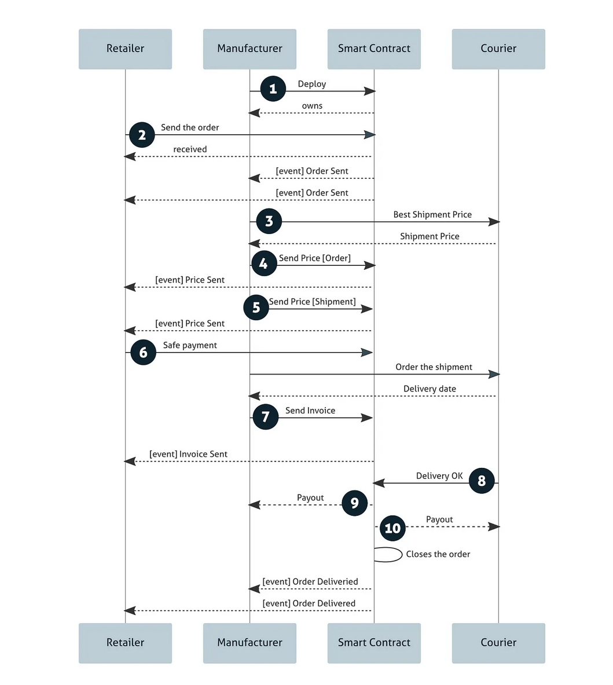

# Verslo modelis ir logika

## Pagrindiniai veikėjai

-   **Mažmenininkas (Retailer)**
-   **Gamintojas (Manufacturer)**
-   **Išmanusis kontraktas (Smart Contract)**
-   **Kurjeris (Courier)**

## Tipinis scenarijus

## Sekų diagrama

## Veiksmų aprašymas

1. Gamintojas sukuria (deploy) išmanąją sutartį skirta specifiniam mažmeninkui
2. Naudojant įvykį (event) mažmeninkas užsisako produktą X ir jo kiekį N gamintojo sukurtame sutartįje.
3. Gamintojas suranda geriausią kurjieriaus kainą per kurjieriaus išmaniąją sutartį.
4. Gamintojas nusiunčia užsakymo kainą ir mažmeninkas gauną ją per įvykį (event) pavadinimu: _price sent_
5. Gamintojas nusiunčia siuntimo kainą ir mažmeninkas gauną ją per įvykį (event) pavadinimu: _price sent_
6. Mažmeninkas atlieka pilną mokėjimą (užsakymas + siuntimas). Šis mokėjimas lieka išmanioje sutartyje iki tol kol siuntimas bus įvykdytas
7. Gamintojas nusiunčia sąskaitą su atsiuntimo data ir kita informacija. Mažmeninkas gauna sąskaitą per įvykį (event) pavadinimu: _invoice sent_
8. Kurjieris po siuntos pridavimo mažmeninkui pažymi, kad siuntimas įvykdytas išmaniojoje sutartyje.
9. Išmanioji sutartis sumoka Gamintojui už užsakymą.
10. Išmanioji sutartis sumoka Kurjieriui už siuntimą.
