# Verslo modelis ir logika

Šis modelis skirtas saugiam fizinių prekių užsakymo, transportavimo pajieškos ir apmokėjimui užtikrinti. Jis tai užtikrina naudojant išmaniają sutartį kuri visus mokėjimus laiko savyje iki kol visų dalyvių įsipareigojimai yra įvykdyti (escrow).

## Pagrindiniai veikėjai

-   **Mažmenininkas (Retailer)**
-   **Gamintojas (Manufacturer)**
-   **Išmanioji sutartis (Smart Contract)**
-   **Kurjeris (Courier)**

## Sekų diagrama

## Veiksmų aprašymas

1. Gamintojas sukuria (deploy) išmanąją sutartį skirta specifiniam mažmeninkui
2. Naudojant įvykį (event) mažmeninkas užsisako produktą X ir jo kiekį N gamintojo sukurtame sutartįje.
3. Gamintojas suranda geriausią kurjieriaus kainą per kurjieriaus išmaniąją sutartį.
4. Gamintojas nusiunčia užsakymo kainą ir mažmeninkas gauną ją per įvykį (event) pavadinimu: _price sent_
5. Gamintojas nusiunčia siuntimo kainą ir mažmeninkas gauną ją per įvykį (event) pavadinimu: _price sent_
6. Mažmeninkas atlieka pilną mokėjimą (užsakymas + siuntimas). Šis mokėjimas lieka išmanioje sutartyje iki tol kol siuntimas bus įvykdytas
7. Gamintojas nusiunčia sąskaitą su atsiuntimo data ir kita informacija. Mažmeninkas gauna sąskaitą per įvykį (event) pavadinimu: _invoice sent_
8. Kurjieris po siuntos pridavimo mažmeninkui pažymi, kad siuntimas įvykdytas išmaniojoje sutartyje.
9. Išmanioji sutartis sumoka Gamintojui už užsakymą.
10. Išmanioji sutartis sumoka Kurjieriui už siuntimą.

# Modelio testavimas

## Lokalus tinklas

Veiksmų eiga:

1. Ganache tinklo paleidimas su komanda: `ganache-cli -p 8545 --chainId 1337 --networkId 1337`
2. Sukompiliuoti sutartį, atidarius naują terminalo langą projekto root direktorijoje paleidžiant šią komandą `truffle compile`
3. Paleisti tinklapį nukeliaujant į `front-end` direktoriją ir paleidžiant komandą: `npm run dev`

Tinklapis:

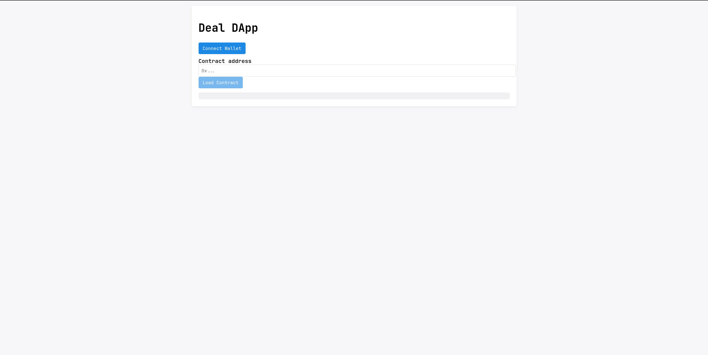

4. Paspaudus "Connect wallet" mygtuką išmetamas šis langas:

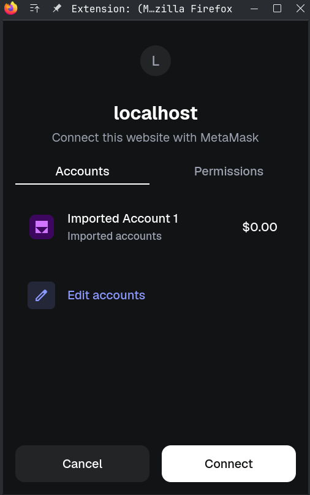

5. Paspaudžiant "Connect" prijungiama Metamask aplinka
6. Toliau pridedama piniginė kurios privatus raktas yra aprašytas 1-o žingsnio terminalo išvestyje (pasirenkamas betkuris raktas)

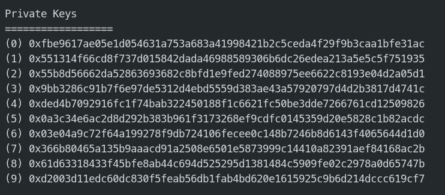

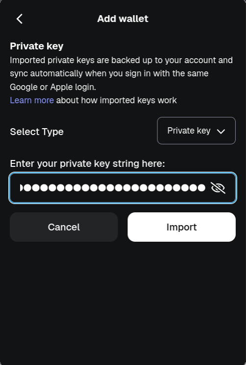

7. Į "contract address" laukelį įvedamas kitos piniginės viešas adresas ir paspaudžiama "load contract"

8. Įvedamas užsakymas ir paspaudžiamas "Send Order"

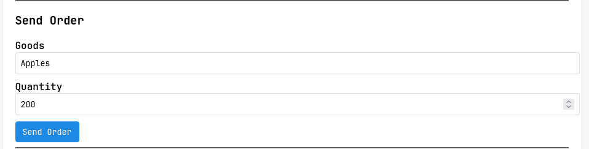

9. Patvirtinama užklausa
10. ganache-cli terminalo aplinkoje matoma įvykdita transakcija:

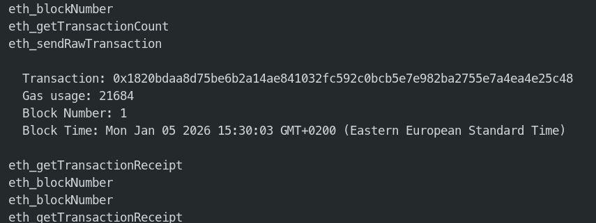

## Testinis tinklas

Veiksmų eiga:

1. Nueinama į Google Sepolia faucet (https://cloud.google.com/application/web3/faucet/ethereum/sepolia) ir gaunama 0.05 ETH pasirinktai piniginei, kad būtu galima testuoti kodą ant Sepolia tinklo

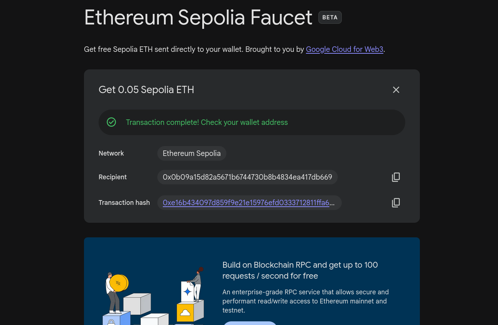

2. Atidaroma https://remix.ethereum.org, įkeliamas sutarties kodas
3. Kodas sukompiliuojamas su 0.4.18 kompiliatorium

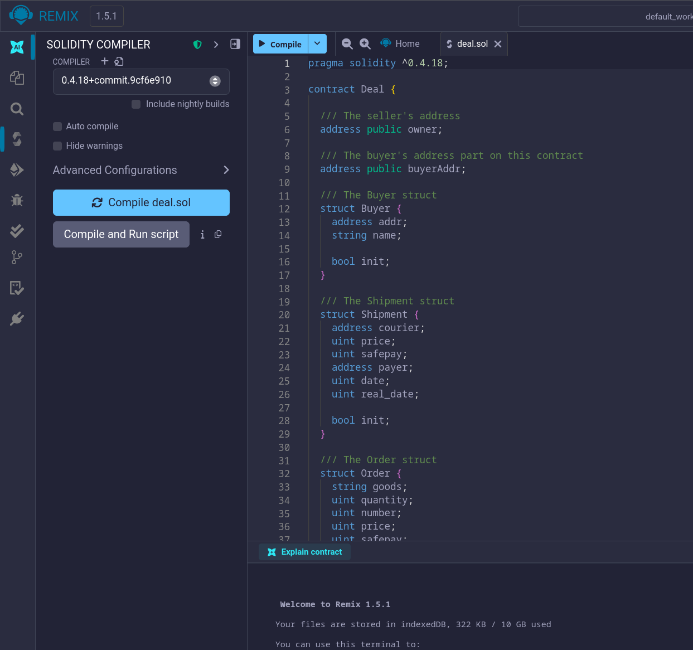

4. Sutartis paleidžiama (deploy) su kitos piniginės adresu "Deploy & Verify" skiltyje.

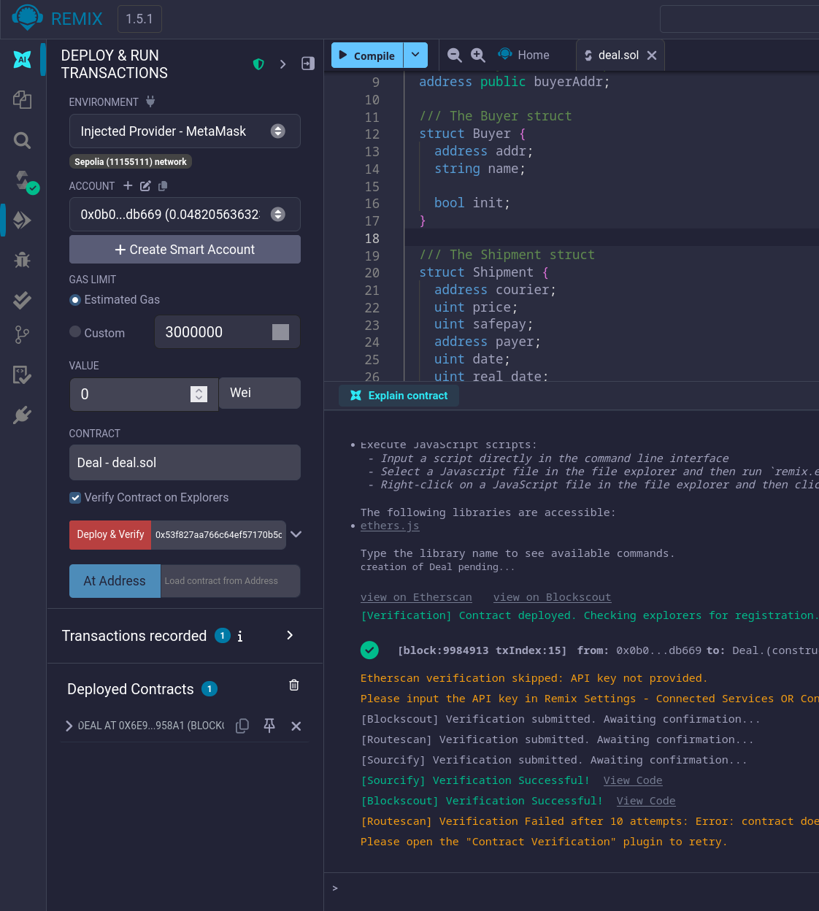

5. Patvirtinama užklausa

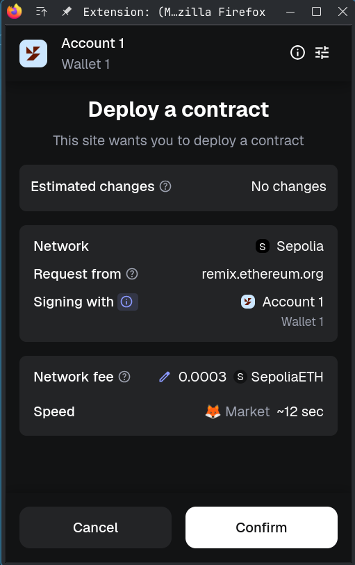

6. Užklausos verifikacija

---

_Kita užklausa (sutarties naudojimas)_

7. Pakeičiama transakcijas vykdanti piniginę į tą kuri buvo nurodyta "Deploy & Verify" skiltyje 4-ame žingsnyje

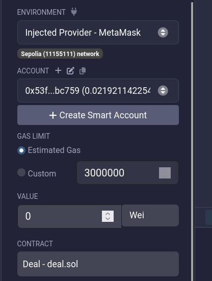

8. Vykdoma "Sendorder" transakcija įvedant produkto pavadinimą ir kiekį.

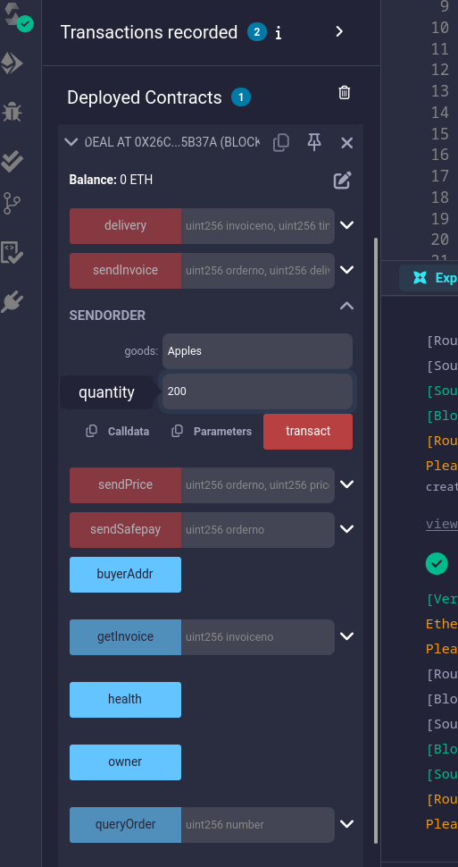

9. Patikrinami transakcijos duomenys

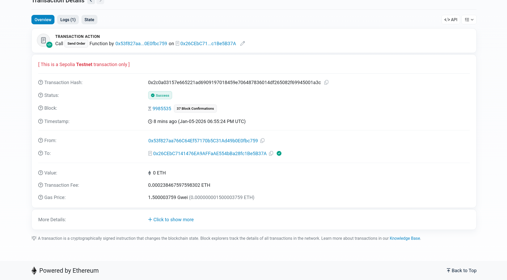
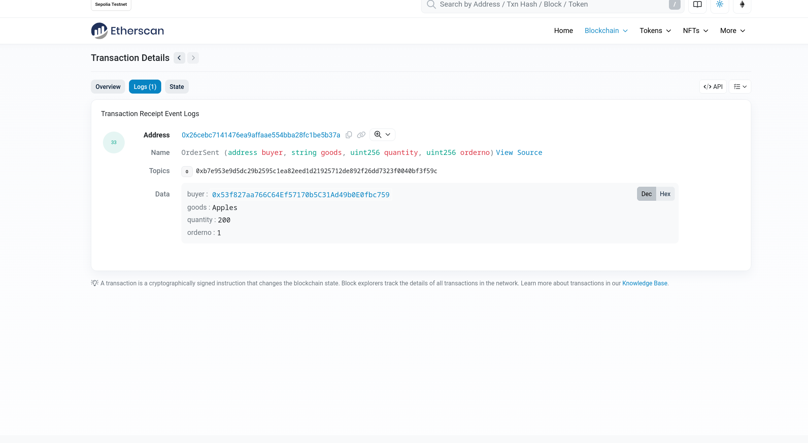

10. Patkrinamos sutarties transakcijos. (_Viena transakcija yra su raudonu šauktuku šalia. Šita transakcija yra nepavykusi transakcija, nes ji buvo vykdyta iš netinkamos piniginės_)

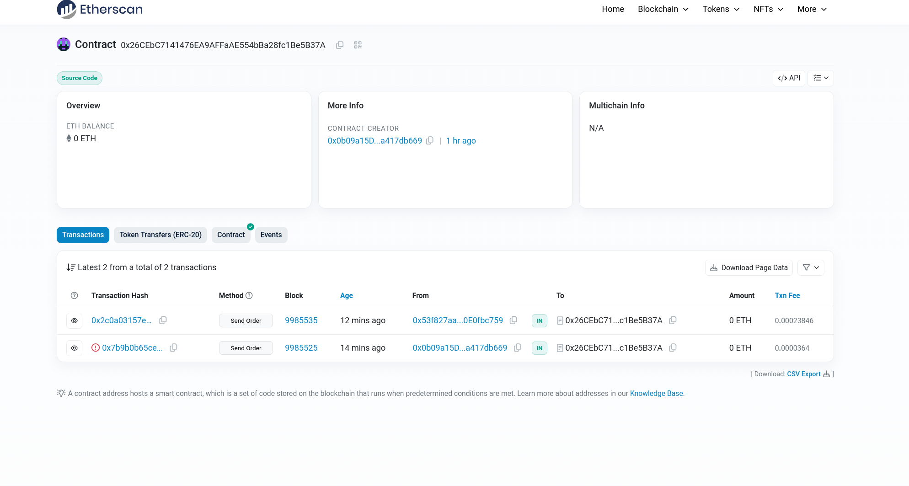

# Kitų intelektinės nuosavybės naudojimas

## Šaltiniai

Šio projekto veikimo principai bei modelio grafikas (./photos/model.png) paimti iš: https://medium.com/coinmonks/build-a-smart-contract-to-sell-goods-6cf73609d25

Šio projekto sutarties kodas (./contracts/Deal.sol) bei kiti failai paimti iš: https://github.com/fabiojose/ethereum-ex

## Dirbtinio intelekto naudojimas

Dirbtinis intelektas buvo naudotas "front-end" tinklapio kodo sugeneravimui React kalba.
